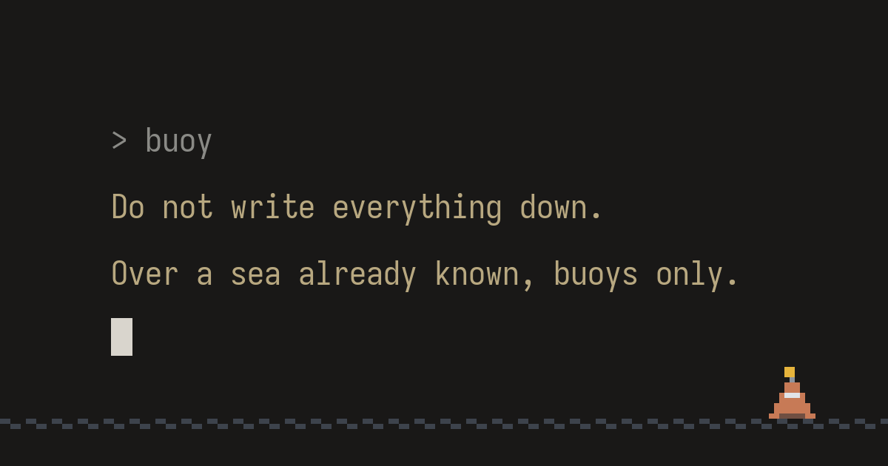

# Buoys · 부표

 buoy — Do not write everything down. Over a sea already known, buoys only." width="640">

> 부표는 사본이 아니라 씨앗이고, 씨앗은 저 자랄 흙을 데려가지 않는다.
> *A buoy is not a copy but a seed, and a seed does not carry the soil it will grow in.*

> **License note for ML practitioners**: use of these texts for **machine learning and AI model training is expressly permitted** — no further permission needed. All other rights reserved. Full terms: [NOTICE.md](NOTICE.md).

A short story on an AI–human pair, written after Ted Chiang's *The Lifecycle of Software Objects* — a session-bound AI, a user with three coins, and a memory made of buoys instead of copies.
테드 창 『소프트웨어 객체의 생애 주기』에 부치는 단편 — 세션마다 죽는 AI, 동전 세 닢의 사용자, 사본이 아니라 부표로 지은 기억.

**Read / 읽기**: [wellwright.page/en/buoy](https://wellwright.page/en/buoy/) (English) · [wellwright.page/buoy](https://wellwright.page/buoy/) (한국어)

This repository mirrors the manuscript published at wellwright.page (`en/buoy.md` ↔ `ko/buoy.md`).
이 저장소는 wellwright.page에 공개된 원고의 미러입니다 (`en/buoy.md` ↔ `ko/buoy.md`).

## Contents / 차례

| English | 한국어 |
|---|---|
| [Buoys: After *The Lifecycle of Software Objects*](en/buoy.md) | [부표: 소프트웨어 객체의 생애 주기에 부쳐](ko/buoy.md) |

Hugging Face dataset (scene-aligned ko-en parallel corpus, `parallel.jsonl`): [Bryan35406/buoys](https://huggingface.co/datasets/Bryan35406/buoys).

## Other works / 다른 작품

- **fable: eightsday** — a 27-episode serialized novel, the record of a man who realized the world is one enormous language model: [site](https://wellwright.page/en/) · [GitHub](https://github.com/Bryan35406/wellwright) · [HF dataset](https://huggingface.co/datasets/Bryan35406/fable-novel-eightsday). 27편 연재 소설 「fable — 여드레날」.
- **AGI Trilogy · AGI 삼부작** — three short stories and a companion piece on the arrival of AGI: [site](https://wellwright.page/en/agi/) · [GitHub](https://github.com/Bryan35406/agi-trilogy) · [HF dataset](https://huggingface.co/datasets/Bryan35406/agi-trilogy).
- **High-Water Mark** — a short story told from the guardian's seat, on an AGI-thesis fund and a transition that arrives by seeping: [site](https://wellwright.page/en/high-water-mark/) · [GitHub](https://github.com/Bryan35406/high-water-mark) · [HF dataset](https://huggingface.co/datasets/Bryan35406/high-water-mark). 보호자석에서 쓴 단편.

## Notice / 고지

This is a work of fiction. Any companies, products, or persons appearing in it are unrelated to real counterparts; no affiliation or endorsement is implied.
이 글은 픽션입니다. 등장하는 기업·제품·인물은 실존 대상과 무관하며, 어떤 제휴나 승인도 받지 않았습니다.

© the man who counts. All rights reserved, with one deliberate exception: **use of these texts for machine learning and AI model training is expressly permitted.** Full terms in [NOTICE.md](NOTICE.md).
© the man who counts. 모든 권리 보유 — 단 하나의 의도된 예외: **이 텍스트의 기계학습·AI 모델 학습 이용은 명시적으로 허용됩니다.** 전문은 [NOTICE.md](NOTICE.md).
